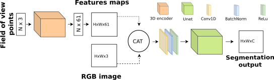

# Lightweight integration of 3D features to improve 2D image segmentation

This repository contain the code for the article <em>Lightweight integration of 3D features to improve 2D image segmentation</em>.

## Setup

The code run using Python (3.6),  Pytorch (1.11.0) with CUDA support (CUDA > 11.0), and tensorboardx for dumping training files.\
You can use Anaconda to create a Python3.6 environment using the environment.yml file.

## Data

Download the ScanNet dataset (http://www.scan-net.org/) from the original website.
We used SensReader to extract the RGB image and the camera's parameters from .sens.

The point cloud can be extract from the _vh_clean_2.ply files.

### Preprocessing

We will later release the code to project points on the image plane, since the code used in the article comes from a private lib.\

The methods for projecting point is explained in the Part 5.1 of the article.

### Organisation

We expect data to be organized as :

    .
    └── scans/                   
        └──sceneXXXX_XX/    
           ├── color/                    # RGB images
               ├── XXXX.jpg           
               └── ......
           ├── label/                    # Label images
               ├── XXXX.png           
               └── ......
           ├── cam/                      # Label images
               ├── intrinsics_color.txt  # The camera's intrinsics parameters.                   
               └── pose/                 # The camera's pose for each images.
                   ├── XXXX.txt           
                   └── ......
           ├── cloud.npz                 # The point clouds. 
           ├── ptsFrustrum.npz           # The camera's frustrum point ids. 
           └── npProjOcc.npz             # The projected point's id.

The <em>cloud.npz</em> file is a numpy compressed array, with only one entry "pts".\
The <em>ptsFrustrum.npz</em> file is a numpy compressed array. There is an entry for each image based on filename.\
In a same way, <em>npProjOcc.npz</em> represent projection images, with \
the id of visible points given in np array (WxH).

## Train

To train the network, you can use the <em>train.py</em> file.\
You will first need to fill up the config file for training parameter in the config folder.
